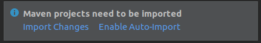
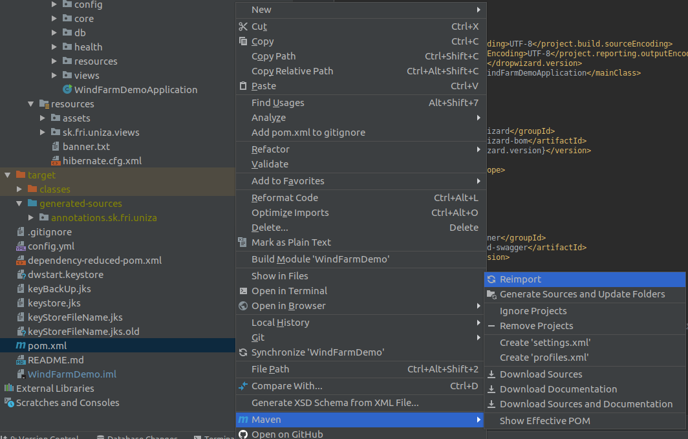
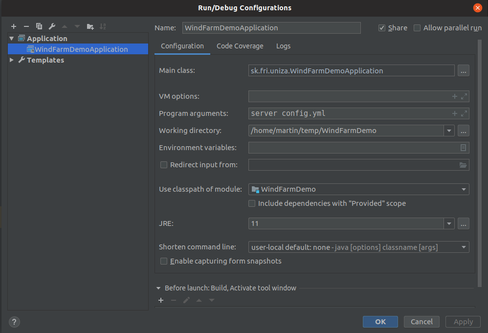

# Importovanie projektu

Naklonovanie projektu z GIT repozitára. 

**`File--> New--> Projetc from Version Control--> Git`**

Url:[https://github.com/hudikm/WindFarmDemo.git]()

1. **Po naklonovaní povolte automaticke importovanie knižníc**
   
    
    
2. **Skompilujte projekt (Build)**
   
    !!! warning "Chyba kompilácie" 
         V prípade, že kompilácia neprebehne správne spustite manuálne  import knižníc. **`pom.xml--> Maven--> Reimport`** 
        
    
3. **Spustenie alikácie**

	- Spustite aplikáciu cez príkazový riadok `java -jar target/WindFarmDemo-1.0-SNAPSHOT.jar server config.yml` alebo nakonfigurujte prostredie:
	- Aplikácia je spustená na adrese: `http://localhost:8080`

!!!note "Inštalácia MariaDB"
     Na inštalovanie databázy odporúčam použiť balík XAMPP, ktorý obsahuje Apache + MariaDB + PHP + Perl. Databázu može konfigurovať pomocou PHPmyadmin prostredia.   [XAMPP](https://www.apachefriends.org/index.html)

## Príhlasenie sa do aplikácie:

Na prihláseni do aplikácie možete použiť dva štandardne vytvorené účty:

- user@gmail.com (readonly)

- admin@gmail.com (admin)

  Heslo: `heslo`
  
  Tieto uživatelské účty sú zadefinované v triede: `UsersDao`