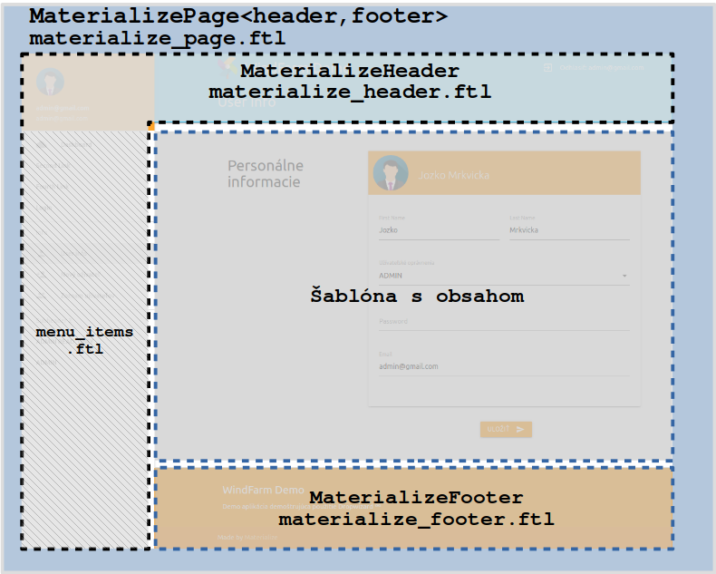
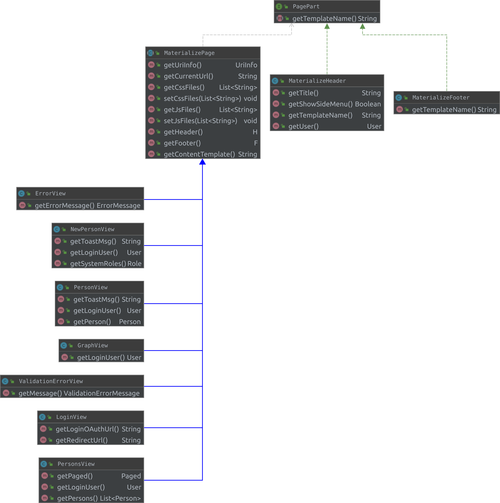

# PageLayout

Stránky sú vytvárané pomocou abstraktnej triedy MaterializePage, ktorá má za úlohu vyvoriť html skelet, ktorý je definovaný v šablóne `materialize_page.ftl`.  HTML skelet načítava potrebné css a js knižnice a je tvorený troma časťami:

1. hlavička / Header
2. hlavný obsah / Body
3. päta / Footer

V demo aplikácii je hlavička tvorená java triedou `MaterializeHeader`, ktorá vytvára šablónu `materialize_header.ftl` . V hlavičke je aj definované bočné menu, ktorého jednotlivé položky  sú definované v šablóne `menu_items.ftl`. Štruktúra jedného odkazu je nasledovná:

```javascript
{"title":"","url":"","icon":"","subheader":"","divider":"","roles":""}
```

!!! note 
     Definicia jedneho odkazu, nemusí obsahovať všetky parametre. Ak sa jedná o klasický odkaz tak v tom prípade `title, url` sú povinné. `Roles` je definované ak pole, ktoré obsahuje textové retazce s názvami rolý, ktoré majú prístup k položke. Ak užívatel  nie je aspoň v jednej z defonovaých rolý nie je daný odkaz zobrazený. Ak nie sú definované žadne role, táto položka je prístupná pre každého aj neprihláseného uživateľa.   




## UML diagram tried z balika sk.fri.uniza.views

