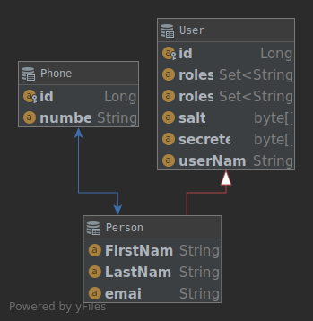

```
.
├── config.yml		#Hlavný konfiguračný súbor
├── keyStoreFileName.jks #Uložený SSL certifikát
├── pom.xml		#Maven zdrojový súbor
├── src			#Zdrojové súbory, ktoré sú popísané nižšie
│   ├── main
│   │   ├── java
│	│	│	...
│   │   └── resources
│	│	│	...
│   └── test
│       ├── java
│       └── resources
└── target 		#Generované súbory
```

## Štruktúra zdrojových súborov

```
├── java
│   └── sk.fri.uniza
│       ├── api 				#Reprezentácia komunikáčných objektov REST rozhrania.
│       │   ├── AccessToken.java	
│       │   ├── LoginApi.java		
│       │   ├── LoginData.java
│       │   ├── OauthRequest.java
│       │   ├── OauthTokenRequest.java
│       │   ├── Paged.java			#Kontajner pre stránkované dáta
│       │   ├── Person.java		
│       │   ├── Phone.java
│       │   ├── PublicKey.java
│       │   └── Saying.java
│       ├── auth				#Autentifikácia a autorizácia
│       │   ├── OAuth2Authenticator.java
│       │   ├── OAuth2Authorizer.java
│       │   ├── OAuth2ClientBuilder.java
│       │   ├── OAuth2Client.java
│       │   ├── OAuth2Clients.java
│       │   └── Role.java
│       ├── cli
│       ├── client
│       ├── config				#POJO objekty mapujúce config.yml
│       │   ├── OAuth2Configuration.java
│       │   └── WindFarmDemoConfiguration.java
│       ├── core			#Triedy, ktoré nie sú používané v API, obyčajné POJO objekty
│       │   ├── PersonBuilder.java
│       │   ├── UserBuilder.java
│       │   └── User.java
│       ├── db					#Triedy tvoriace prístup k databáze 
│       │   ├── BasicDao.java			#Základné rozhranie definujúce CRUD operácie s DB
│       │   ├── PersonDao.java
│       │   └── UsersDao.java
│       ├── health
│       │   └── TemplateHealthCheck.java
│       ├── resources
│       │   ├── HelloWorldResource.java
│       │   ├── LoginResource.java
│       │   ├── PersonResource.java
│       │   └── UsersResource.java
│       ├── views				#Triedy, ktoré vytvárajú webové stránky 
│       │   ├── ErrorView.java
│       │   ├── LoginPageViewBuilder.java
│       │   └── LoginPageView.java
│       └── WindFarmDemoApplication.java
└── resources
    ├── assets					#Súbory, ktoré sú využívané pri generovaný web stránok. 
    │   ├── css
    │   │   ├── materialize.css			#Hlavný CSS súbor používaný knižnicou MATERIALIZECSS
    │   │   ├── materialize.min.css
    │   │   └── style.css			#Vlástné úpravy CSS 
    │   ├── img
    │   │   ├── favicon.png
    │   │   ├── img_avatar.png
    │   │   ├── logo.png
    │   │   ├── logo_small.png
    │   │   ├── sample-1.jpg
    │   │   ├── windmill_sunset2.png
    │   │   ├── windmill_sunset.png
    │   │   └── yuna.jpg
    │   ├── index.htm
    │   └── js
    │       ├── init.js  #V tomto súbore sa vykonáva inicializácia použitých javascriptových komponentov MATERIALIZECSS. 
    │       ├── materialize.js	
    │       └── materialize.min.js #Hlavný javascript súbor používaný knižnicou MATERIALIZECSS
    ├── banner.txt
    ├── hibernate.cfg.xml	#Hibernate konfiguračný súbor. V prípade dropwizárdu sa využíva iba v rámci IDE prostredia pre "Persistance plugin". Všetky realne nastavenia sa musia upravovať v config.yml
    └── sk.fri.uniza
        └── views	#Šabloný html stránok, Umiestnenie v priečinku musí zodpovedať názvu baliká v JAVE
            ├── error_page.ftl
            └── loginPage.ftl

```


## ER diagram

